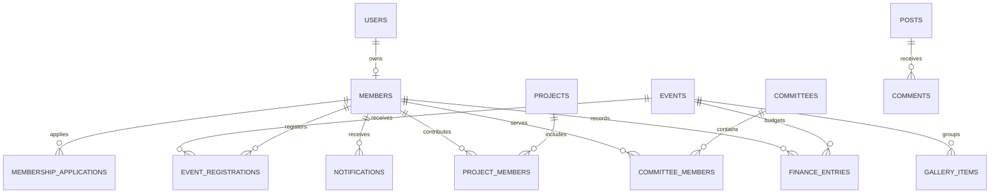

# Data model

The Convex schema is organized by bounded domains. Relationships are stored as typed document IDs and supported by named indexes for every high-volume read path.

## Scale decisions

- Event registrations, project members, committee members, notifications, and finance entries are separate tables rather than growing arrays.
- Member UUID sequence allocation is transactional for each configurable galaxy/star code pair.
- List queries are bounded or paginated and use declared indexes instead of table filters.
- Public content and sensitive member/finance fields have separate response shapes.
- Uploaded files store Convex storage IDs; URLs are resolved at read time.
